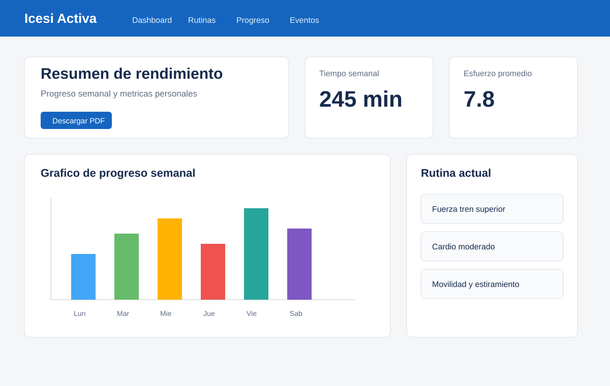
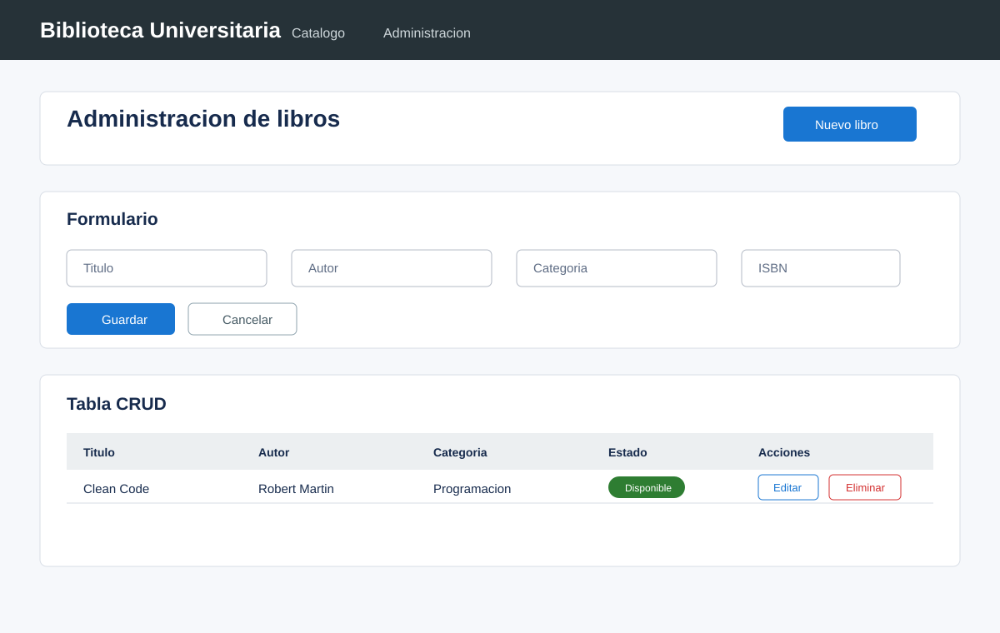
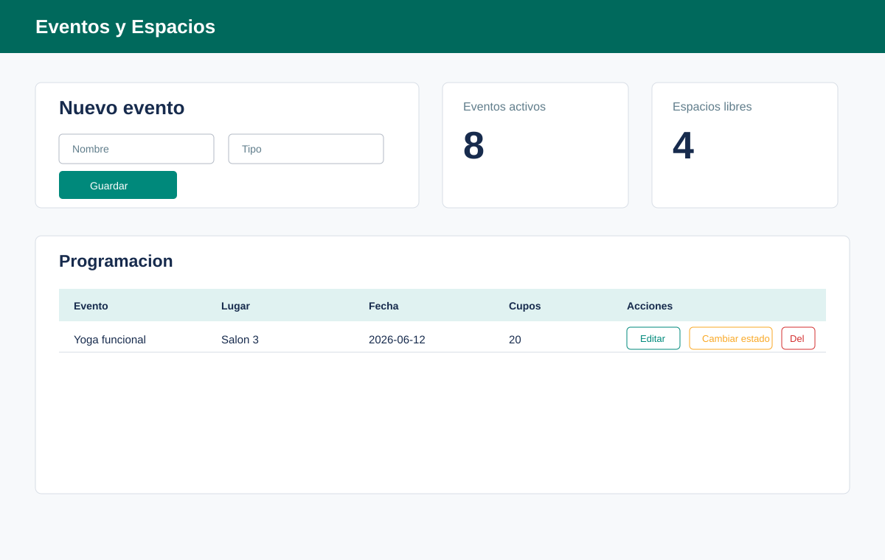
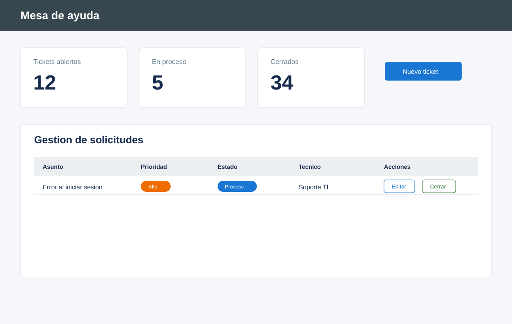

# Guia visual de componentes

Este documento conecta los mockups con los componentes React que normalmente debes construir en un parcial.

## 1. Dashboard de actividad fisica



Componentes sugeridos:

- `Navbar`: navegacion principal.
- `SummaryCard`: tarjeta para metricas como tiempo, esfuerzo o sesiones.
- `ProgressChart`: grafico de barras o lineas.
- `RoutineCard`: tarjeta para la rutina actual.
- `ReportButton`: boton para descargar PDF.

Estructura minima:

```jsx
<main className="container py-4">
  <section className="row g-3 mb-4">
    <SummaryCard title="Tiempo semanal" value="245 min" />
    <SummaryCard title="Esfuerzo promedio" value="7.8" />
  </section>
  <section className="row g-3">
    <div className="col-lg-8">
      <ProgressChart data={progressData} />
    </div>
    <div className="col-lg-4">
      <RoutineCard routine={currentRoutine} />
    </div>
  </section>
</main>
```

## 2. CRUD de biblioteca



Componentes sugeridos:

- `BookFormDialog`: formulario controlado para crear y editar.
- `BookTable`: tabla reutilizable.
- `BooksPage`: pagina de consulta.
- `AdminPage`: pagina con CRUD completo.

Metodos HTTP:

| Accion | Metodo |
| --- | --- |
| Cargar tabla | `GET /books` |
| Crear desde formulario | `POST /books` |
| Editar fila seleccionada | `PUT /books/{id}` |
| Eliminar fila | `DELETE /books/{id}` |

Estructura minima:

```jsx
<main className="container py-4">
  <button onClick={handleCreateClick}>Nuevo libro</button>
  {showForm && <BookFormDialog selectedBook={selectedBook} onSubmit={handleSubmit} />}
  <BookTable books={books} onEdit={handleEditClick} onDelete={handleDelete} />
</main>
```

## 3. Eventos y espacios



Componentes sugeridos:

- `EventForm`: formulario de evento.
- `EventTable`: tabla con acciones.
- `EventsPage`: pagina principal.

Metodos HTTP:

| Accion | Metodo |
| --- | --- |
| Listar eventos | `GET /events` |
| Crear evento | `POST /events` |
| Editar evento | `PUT /events/{id}` |
| Cambiar estado | `PATCH /events/{id}` |
| Eliminar evento | `DELETE /events/{id}` |

Estructura minima:

```jsx
const handleToggleActive = async (event) => {
  const updated = await eventService.updateStatus(event.id, !event.active)
  setEvents((currentEvents) =>
    currentEvents.map((currentEvent) =>
      currentEvent.id === event.id ? updated : currentEvent,
    ),
  )
}
```

## 4. Tickets y soporte



Componentes sugeridos:

- `TicketSummary`: tarjetas de conteo.
- `TicketForm`: formulario para crear ticket.
- `TicketTable`: tabla con prioridad, estado y acciones.
- `TicketDetail`: detalle con comentarios.

Metodos HTTP:

| Accion | Metodo |
| --- | --- |
| Listar tickets | `GET /tickets` |
| Crear ticket | `POST /tickets` |
| Editar ticket | `PUT /tickets/{id}` |
| Cerrar ticket | `PATCH /tickets/{id}` |
| Agregar comentario | `POST /tickets/{id}/comments` |

## 5. Recomendacion visual para parcial

Construye pantallas simples:

- Un contenedor `container py-4`.
- Un encabezado con titulo y boton principal.
- Un formulario dentro de una tarjeta.
- Una tabla responsive.
- Alertas de carga y error.
- Badges para estados.

Con eso la interfaz se ve completa sin agregar elementos innecesarios.

